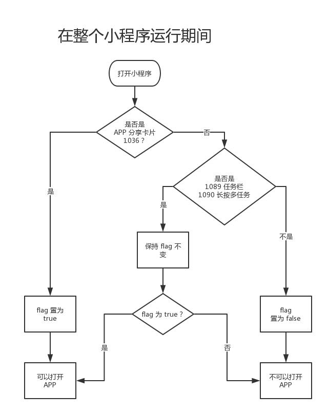

# 打开 App

因为需要用户主动触发才能打开 APP，所以该功能不由 API 来调用，需要用 `open-type` 的值设置为 `launchApp` 的 `<button>` 组件的点击来触发。

当小程序从 APP 分享消息卡片的场景打开时（场景值 1036，APP 分享小程序文档 iOS [参见][ios]，Android [参见][android]），小程序会获得打开 APP 的能力，此时用户点击按钮可以打开分享该卡片的 APP。即**小程序不能打开任意 APP，只能跳回分享该小程序卡片的 APP**。

在一个小程序的生命周期内，只有在特定条件下，才具有打开 APP 的能力。 打开 APP 的能力可以理解为由小程序框架在内部管理的一个状态，为 true 则可以打开 APP，为 false 则不可以打开 APP。

在小程序的生命周期内，这个状态的初始值为 false，之后会随着小程序的每次打开（无论是启动还是切到前台）而改变：

- 当小程序从 1036（App 分享消息卡片） 打开时，该状态置为 true。
- 当小程序从 1089（微信聊天主界面下拉）或 1090（长按小程序右上角菜单唤出最近使用历史）的场景打开时，该状态不变，即保持上一次打开小程序时该状态的值。
- 当小程序从非 1036/1089/1090 的场景打开，该状态置为 false。



## 使用方法

需要将 `<button>` 组件 `open-type` 的值设置为 `launchApp`。如果需要在打开 APP 时向 APP 传递参数，可以设置 `app-parameter` 为要传递的参数。通过 `binderror` 可以监听打开 APP 的错误事件。

### 例子

```html
<button open-type="launchApp" app-parameter="wechat" binderror="launchAppError">打开APP</button>
```

```js
Page({ 
  launchAppError: function(e) { 
    console.log(e.detail.errMsg) 
  } 
})
```

## error 事件参数说明

```js
'invalid scene': '调用场景不正确，即此时的小程序不具备打开 APP 的能力。'
```

## REF

- [打开 App - 小程序][api]

[api]: https://mp.weixin.qq.com/debug/wxadoc/dev/api/launchApp.html
[ios]: https://open.weixin.qq.com/cgi-bin/showdocument?action=dir_list&t=resource/res_list&verify=1&id=open1419317332&token=&lang=zh_CN
[android]: https://open.weixin.qq.com/cgi-bin/showdocument?action=dir_list&t=resource/res_list&verify=1&id=open1419317340&token=&lang=zh_CN