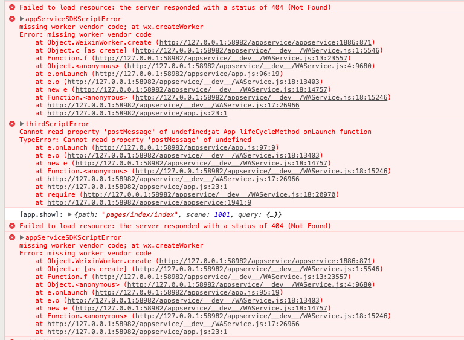

# 多线程 Worker

一些异步处理的任务，可以放置于 Worker 中运行，待运行结束后，再把结果返回到小程序主线程。Worker 运行于一个单独的全局上下文与线程中，不能直接调用主线程的方法。 Worker 与主线程之间的数据传输，双方使用 `Worker.postMessage()` 来发送数据，`Worker.onMessage()` 来接收数据，传输的数据并不是直接共享，而是被复制的。

## 使用步骤

### 1. 配置 Worker 信息

在 `app.json` 中可以配置 `Worker` 代码放置的目录，目录下的代码将被打包成一个文件：

```json
{
  "workers": "workers"
}
```

### 2. 添加 Worker 代码文件

根据步骤 1 中的配置，在代码目录下新建两个入口文件：

```sh
workers/request/index.js
workers/request/utils.js
workers/response/index.js
```

### 3. 编写 Worker 代码

在 `workders/request/index.js` 编写 Worker 响应代码

```js
var utils = require('./utils')

// 在 Worker 线程执行上下文会全局暴露一个 `worker` 对象，直接调用 worker.onMeesage/postMessage 即可
worker.onMessage(function(res) {
  console.log(res)
})
```

### 4. 在主线程初始化 Worker

在主线程的代码 `app.js` 中初始化 Worker

```js
var worker = wx.createWorker('worker/request/index.js')
```

### 5. 主线程向 Worker 发送消息

```js
worker.postMessage({
  msg: 'hello worker'
})
```

## 注意事项

1. Worker 最大并发数量限制为 1 个，创建下一个前请用 `Worker.terminate()` 结束当前 Worker
2. Worker 内代码只能 `require` 指定 Worker 路径内的文件，无法引用其它路径
3. Worker 的入口文件由 `wx.createWorker()` 时指定，开发者可动态指定 Worker 入口文件
4. Worker 内不支持 wx 系列的 API
5. Workers 之间不支持发送消息

## wx.createWorker(scriptPath)

> 基础库 1.9.90 开始支持（2018.03.07 左右）

创建一个 Worker 线程，并返回 Worker 实例。

Worker 对象的方法如下：

```js
worker.postMessage(Object)
worker.onMessage(callback)
worker.terminate()
```

## bug 记录

2018 年 3 月 27 日，macOS 10.13.3 平台的开发者工具（v1.02.1803210），基础库 1.9.94。使用官方的 demo 代码，会报错：



## REF

- [多线程 Worker][workers]

[workers]: https://mp.weixin.qq.com/debug/wxadoc/dev/framework/workers.html
[api]: https://mp.weixin.qq.com/debug/wxadoc/dev/api/createWorker.html